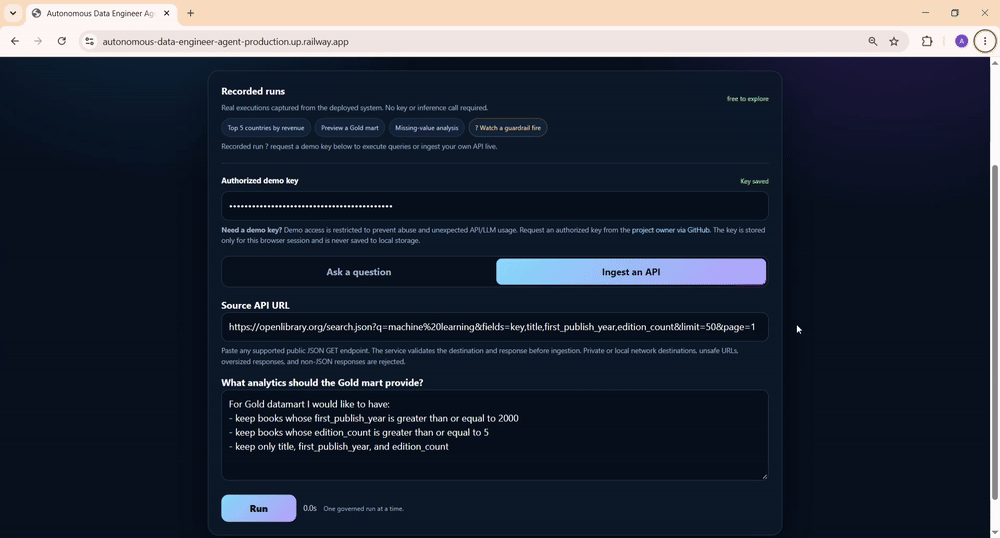
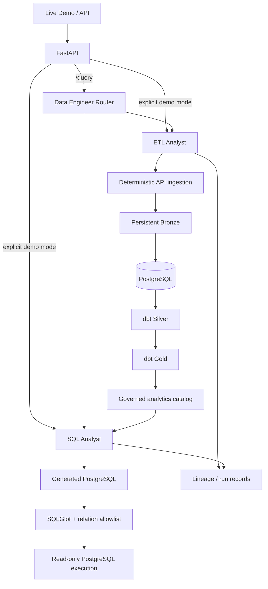

# Autonomous Data Engineer Agent

<p align="center">
  <strong>Agentic data engineering with deterministic safety boundaries.</strong><br>
  Turn a public API + natural-language intent into governed Bronze/Silver/Gold data products, then query them through validated read-only SQL.
</p>

<p align="center">
  <a href="https://github.com/Toukennn/Autonomous-data-engineer-agent/actions/workflows/ci.yml"></a>
  
  
  
  
  
</p>

<p align="center">
  <a href="https://autonomous-data-engineer-agent-production.up.railway.app/"><strong>Live Demo</strong></a>
  ·
  <a href="https://autonomous-data-engineer-agent-production.up.railway.app/docs"><strong>Swagger API</strong></a>
  ·
  <a href="docs/README.md"><strong>Documentation</strong></a>
</p>

> **Core design principle:** LLMs decide *what* supported workflow should happen. Deterministic code decides *how it is allowed to happen*.

---

## Demo

<p align="center">
  
</p>

The demo shows an external JSON API being ingested into a governed Medallion pipeline, transformed with dbt, published as a Gold mart, and queried through the SQL Analyst.

**New dataset? Run `Ingest an API` first.** Once the ETL Analyst publishes the Gold mart, switch to `Ask a question` to query it.

Recorded cloud runs are available on the demo page without credentials. Live execution is protected by a dedicated demo key.

---

## Why I built this

A typical agent prototype can look like:

```text
LLM → tool call → execution
```

This project deliberately adds deterministic engineering boundaries around the model:

```text
Natural-language intent
        ↓
typed / bounded plan
        ↓
deterministic validation
        ↓
controlled execution
        ↓
durable data + observable result
```

The goal is to explore how agentic workflows can be useful in **real data engineering systems** without giving the LLM unrestricted control over APIs, files, dbt, or the database.

---

## What it does

| Capability | What happens |
|---|---|
| **API ingestion** | Safely inspects and ingests supported public JSON APIs |
| **Bronze layer** | Persists source data and incremental state |
| **Warehouse sync** | Loads governed Bronze data into PostgreSQL |
| **dbt Silver** | Builds cleaned / structured transformations |
| **dbt Gold** | Creates analytics-ready marts from validated transformation plans |
| **Natural-language analytics** | Converts questions into PostgreSQL |
| **SQL governance** | Validates SQL with SQLGlot and a governed relation allowlist |
| **Read-only execution** | Executes bounded queries with row and statement limits |
| **Observability** | Tracks run IDs, execution stages, lineage, and safe structured events |
| **Cloud deployment** | Runs on Railway with managed PostgreSQL and persistent application storage |

---

## Architecture



The system has three main agents:

- **Data Engineer Router** — top-level routing for the general `/query` API
- **ETL Analyst** — API ingestion and governed Bronze → Silver → Gold orchestration
- **SQL Analyst** — governed analytical SQL generation and execution

The interactive demo calls the ETL and SQL specialists directly because the visitor explicitly chooses the workflow.

---

## Safety by design

LLM output is treated as **untrusted input**.

### ETL path

```text
LLM transformation intent
        ↓
Pydantic validation
        ↓
deterministic compiler / tools
        ↓
bounded dbt + warehouse execution
```

### SQL path

```text
LLM-generated SQL
        ↓
SQLGlot AST validation
        ↓
Silver/Gold relation allowlist
        ↓
read-only PostgreSQL
```

The model does **not** receive unrestricted:

- shell or Python execution
- arbitrary filesystem access
- arbitrary PostgreSQL writes
- arbitrary dbt commands
- unrestricted Jinja execution
- direct control over merge/checkpoint semantics

Additional safeguards include API destination validation, redirect controls, response-size limits, authentication, concurrency control, SQL statement limits, and bounded result sizes.

---

## Engineering highlights

- **Medallion architecture:** persistent Bronze → dbt Silver → dbt Gold
- **Resilient API ingestion:** retries, pagination limits, redirects, response limits, and public-destination validation
- **Incremental processing:** persistent watermark state and business-key-aware merge/upsert behavior
- **Schema evolution:** deterministic compatibility policy rather than unconstrained model decisions
- **Data quality:** contracts and dbt tests can stop invalid promotion
- **Generated dbt models:** typed transformation plans compile into deterministic SQL/dbt artifacts
- **Governed analytics:** only approved Silver/Gold physical relations are queryable
- **SQL safety:** SQLGlot AST validation before execution
- **Read-only warehouse access:** bounded PostgreSQL queries with statement and row limits
- **Runtime hardening:** API-key authentication, execution timeouts, single-run concurrency protection, safe request/run IDs
- **Container security:** non-root Docker runtime
- **CI/CD:** Ruff, pytest, package build, Docker build, container health check, and non-root smoke test
- **Real cloud deployment:** Railway application + managed PostgreSQL + persistent runtime storage

---

## Tech stack

<p>
  
  
  
  
  
  
  
  
  
  
  
  
  
  
  
</p>

---

## Live demo workflow

The browser demo exposes two explicit specialist workflows.

### 1. Ingest a new dataset

```text
Public JSON API
    ↓
safe record discovery
    ↓
Bronze persistence
    ↓
PostgreSQL
    ↓
dbt Silver
    ↓
dbt Gold
    ↓
governed analytics catalog
```

### 2. Query the generated data product

```text
Natural-language question
    ↓
selected governed Gold/Silver relation
    ↓
generated PostgreSQL
    ↓
SQLGlot validation
    ↓
read-only execution
    ↓
result table + grounded answer
```

A successful ingestion exposes the new Gold relation so it can immediately be selected by the SQL Analyst.

---

## Run locally

### Docker Compose

```bash
cp .env.example .env
docker compose up -d --build
```

Then open:

```text
http://127.0.0.1:8000/
```

Health endpoints:

```bash
curl http://127.0.0.1:8000/health
curl http://127.0.0.1:8000/ready
```

### Python / uv

```bash
uv sync --locked --python 3.12
uv run uvicorn app.api:app --host 0.0.0.0 --port 8000
```

See [Running & Configuration](docs/running-and-configuration.md) for environment variables and database setup.

---

## Testing & CI

Run locally:

```bash
uv run ruff check .
uv run pytest -v
```

GitHub Actions also validates:

- Ruff and the deterministic unit test suite
- real PostgreSQL connectivity
- dbt Silver/Gold builds against an ephemeral PostgreSQL service
- governed catalog discovery and bounded Gold queries through `DatabaseUtil`
- package build
- Docker image build
- container startup
- `/health`
- non-root runtime (`UID 10001`)
- resolved persistent runtime storage

---

## API & deployment

| Endpoint | Purpose |
|---|---|
| `/` | Portfolio demo |
| `/docs` | Swagger / OpenAPI |
| `/health` | Liveness |
| `/ready` | Dependency readiness |
| `POST /query` | General routed agent API |
| `/demo/*` | Explicit ETL / SQL demo workflows |

The deployed v1 runs as a **single instance with one active agent run at a time**. This is intentional because generated dbt state, execution locks, and some runtime state are currently process-local.

---

## v1 scope

This repository is a portfolio-grade **v1**, not a claim of enterprise completeness.

Implemented end to end:

- governed ETL from external APIs
- persistent Medallion storage
- PostgreSQL + dbt transformations
- incremental state
- schema evolution controls
- data-quality gates
- lineage and execution records
- natural-language governed SQL analytics
- deterministic SQL validation
- FastAPI hardening
- Dockerized runtime
- CI
- real cloud deployment

Deliberately deferred:

- distributed task queues
- horizontal multi-replica coordination
- advanced CDC deletion/tombstone semantics
- SCD Type 2 modeling
- heavy centralized tracing / metrics infrastructure
- broader enterprise orchestration and security layers

See [Limitations & Roadmap](docs/limitations-and-roadmap.md).

---

## Documentation

- [Documentation index](docs/README.md)
- [Architecture](docs/architecture.md)
- [Safety model](docs/safety-model.md)
- [Running & configuration](docs/running-and-configuration.md)
- [Testing & operations](docs/testing-and-operations.md)
- [Limitations & roadmap](docs/limitations-and-roadmap.md)

---

## License

See the repository license for usage terms.
